# hf-predict

Offline-first HF propagation prediction and measurement for amateur radio, for Windows, Linux and macOS.

- **Predict** — model what HF propagation should be doing, using the real VOACAP engine running locally.
- **Measure** — listen to what the station is actually hearing, through WSJT-X.
- **Compare** — show where prediction and observation agree or disagree, turn that into a band recommendation, and scan the bands to keep the picture current.

The application stays useful with little or no Internet: portable operation, Field Day, EmComm and disaster response. It never transmits; there is no transmit function anywhere in it.

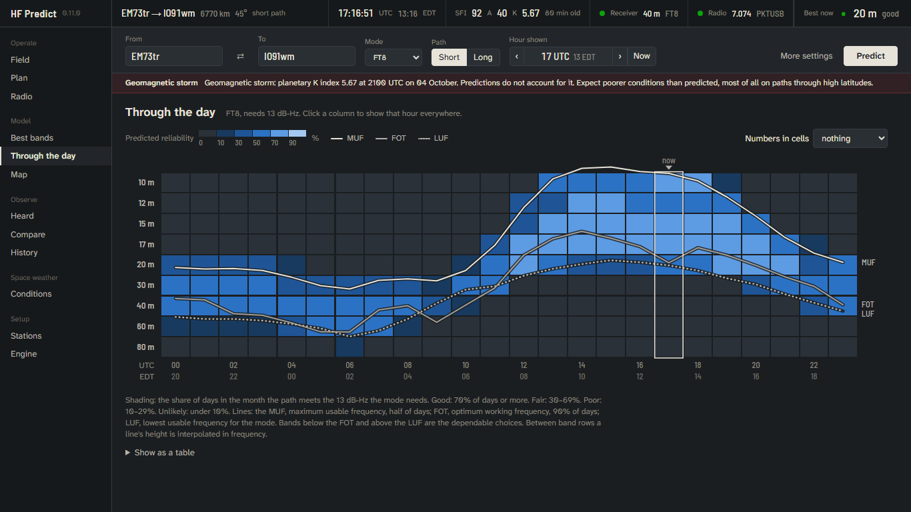

## Status

All ten phases of the [roadmap](docs/engineering-assessment.md#18-implementation-roadmap) are in, as of v0.10.2 (October 2026). Installers for Windows, macOS and Linux are on the [Releases](https://github.com/KK4ODA/hf-predict/releases) page and the app updates itself from there. Builds are not code-signed yet, so Windows and macOS warn on install.

## What it does

| Tab | What you get |
|---|---|
| **Best bands** | For a path and an hour: each band's predicted reliability and SNR, the hours it is worth trying, and the effect of transmit power. Short or long path. |
| **Compare** | Prediction beside what your own receiver heard toward the destination in the last hour, and a plain recommendation per band (HIGH PRIORITY, TRY, INVESTIGATE, …). Beside it, the other direction: stations that way heard sending signal reports to you or to stations near you. |
| **Field** | One simplified screen: the three bands to try, their good hours, conditions, how old every piece of data is, and the map. Everything from data on the computer. |
| **Most contacts** | For working as many stations as possible rather than one place: each band ranked by how many of the stations in your log it should reach at the hour shown, by distance, and through the day. |
| **Through the day** | Usable frequency range hour by hour, and an hour-by-band table. |
| **Map** | Pick either end of the path on a zoomable world map, with day and night, a coverage overlay showing where a band reaches, and the stations heard. |
| **Heard** | What WSJT-X is decoding right now, per-band activity, who hears your area (from the signal reports distant stations send to you and your neighbours), a check of the computer's clock, and the `ALL.TXT` logs of any number of WSJT-X installations, read in place. |
| **Plan** | A listening plan: which bands to listen on, in what order and for how long, from the prediction, what was heard in the last hour and how long each band has gone unsampled. Follow it by hand, tick its bands in WSJT-X's band hopping, or let the app move the radio. |
| **Radio** | Reads the radio through a `rigctld` shared with WSJT-X: frequency, mode, PTT, split and VFO, and whether WSJT-X sees the same dial. The app can start `rigctld` and WSJT-X itself, in the right order. |
| **History** | Checks the predictions against every decode you have stored: were places heard more often where the model said they would be? |
| **Conditions** | Solar flux, A and K indices, storm state, three-day and 27-day forecasts, with source and age; fetched from NOAA, or requested over Winlink and imported from files or pasted text. The smoothed sunspot table the model uses, bundled and refreshable. |
| **Engine** | The exact input and output of the VOACAP run behind the prediction, and who made the engine. |

A status strip across the top shows the path, the time in UTC and local time, solar flux and indices, the receiver, the radio and the best band now, on every screen; warnings for a geomagnetic storm and for a computer clock that is off appear beneath it. Dark and Daylight themes; keyboard shortcuts (Ctrl+Enter predicts, Alt+1 to Alt+0 switch views, [ and ] step the hour). The design is described, with before and after screenshots, in [docs/design-system.md](docs/design-system.md).

### Screenshots

Taken with a real FT8 prediction from the engine (EM73tr to IO91wm, October) and recorded decodes.

| | |
|---|---|
| 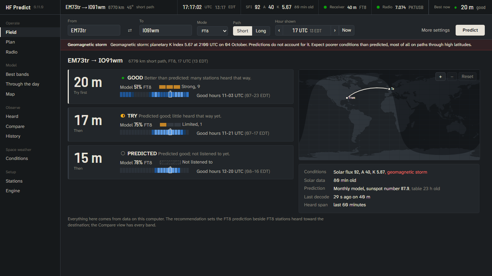 **Field**: the bands to try now, their good hours, conditions and data age | 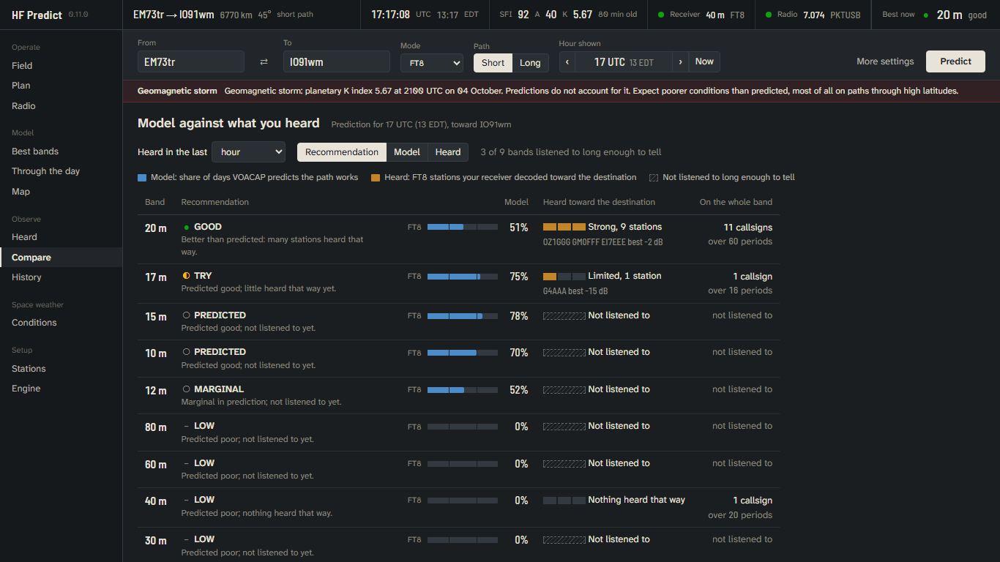 **Compare**: the model (blue) beside what was heard toward the destination (amber) |
| 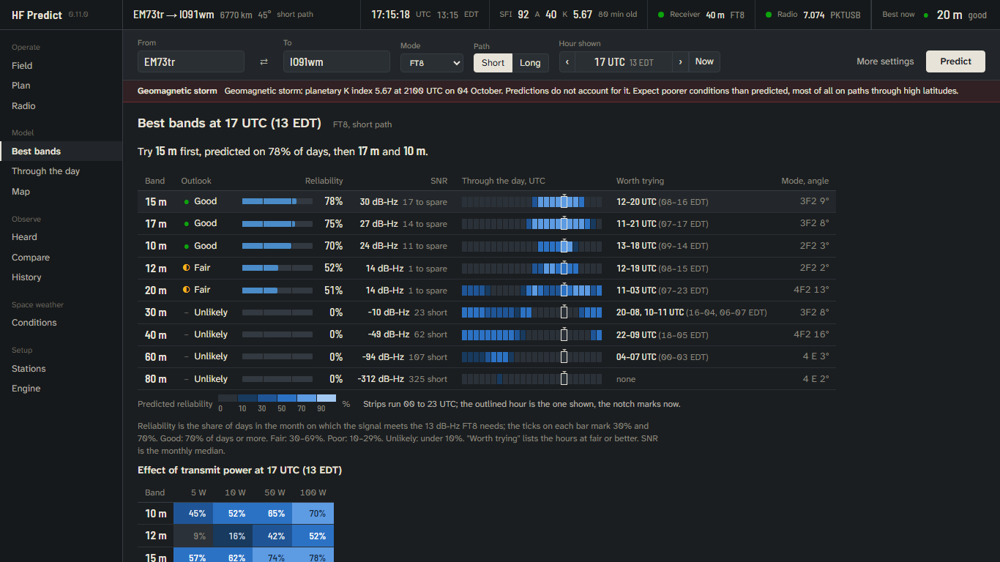 **Best bands**: every band ranked for the hour, with a 24-hour strip each | 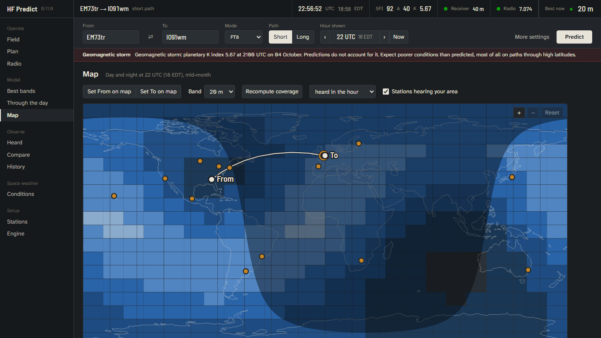 **Map**: predicted coverage, stations heard, path, day and night |
| 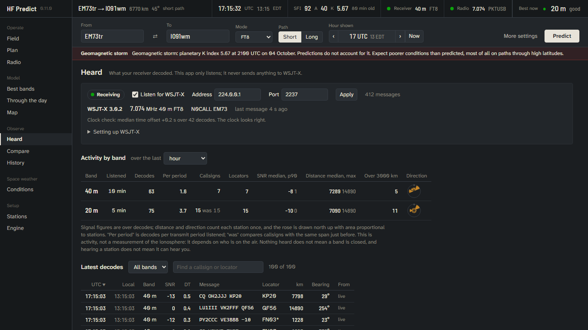 **Heard**: what WSJT-X decoded, by band and station | 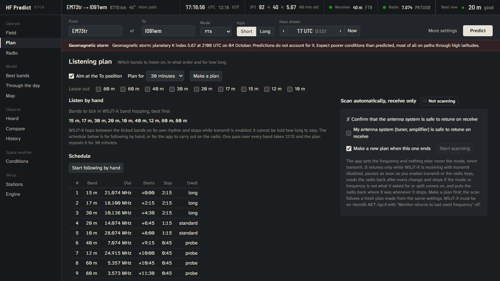 **Plan**: a listening plan to follow by hand, or a receive-only scan |
| 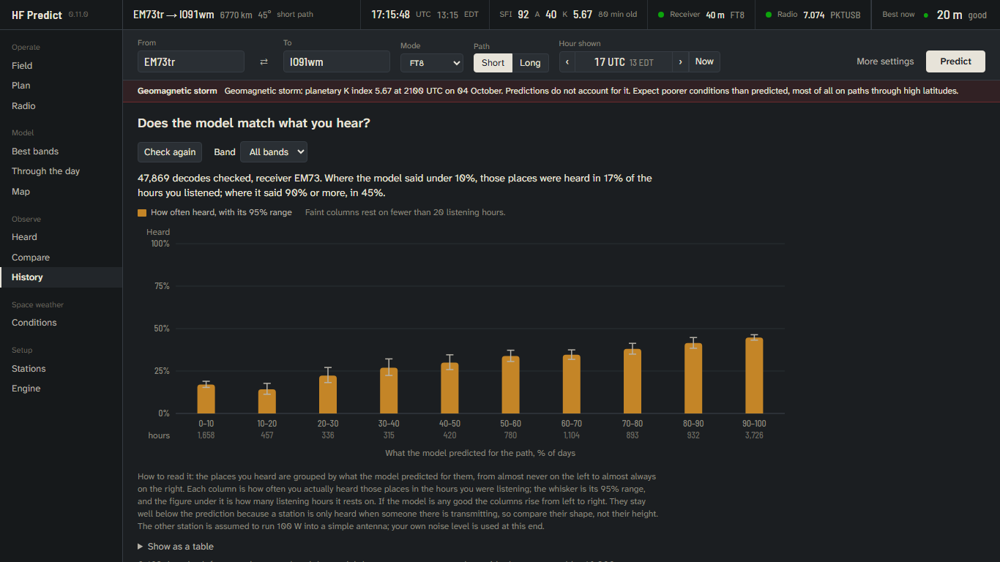 **History**: how often places were heard against what the model predicted | 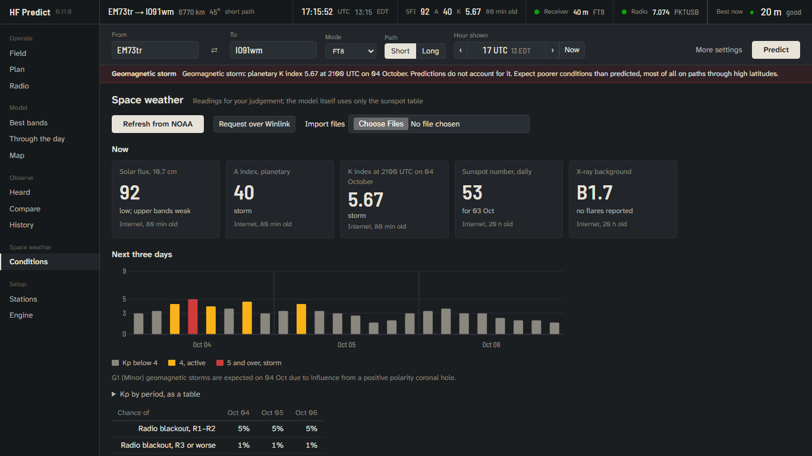 **Conditions**: solar and geomagnetic readings with source and age |
| 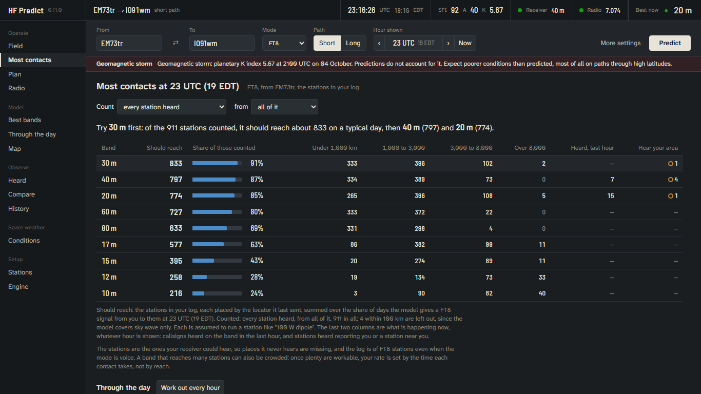 **Most contacts**: bands ranked by how many stations in your log they should reach | |
| 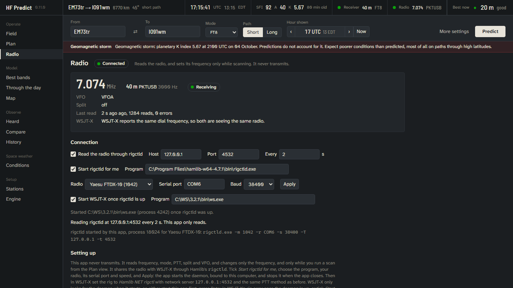 **Radio**: the radio through a shared `rigctld` | 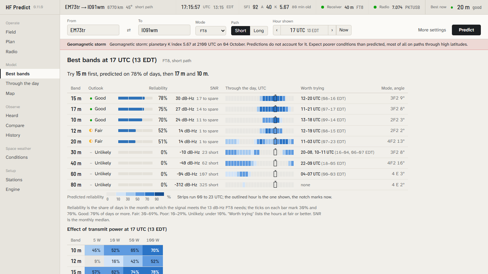 **Daylight** theme for outdoor use |

## Getting started

The [user manual](docs/manual.md) explains every view and setting. In short:

1. Install from [Releases](https://github.com/KK4ODA/hf-predict/releases). Enter your position in **From** (a locator such as `EM73tr`, or latitude, longitude) and a destination in **To**, pick your station preset, and press **Predict**.
2. **Hearing.** In WSJT-X, File → Settings → Reporting, set the UDP server to `224.0.0.1`, port `2237` (a multicast group, so GridTracker, JTAlert and this app can all listen). On the Heard tab tick *Listen for WSJT-X*. To bring in history, add your `ALL.TXT` logs there (*Find logs* lists the ones in the usual folders); they are re-read on start-up, new lines only.
3. **Radio** (optional, for scanning). Install Hamlib if WSJT-X did not ship `rigctld-wsjtx`. On the Radio tab tick *Start rigctld for me*, choose the program, your radio, its serial port and speed, and optionally *Start WSJT-X once rigctld is up*. In WSJT-X set the rig to *Hamlib NET rigctl* with network server `127.0.0.1:4532`, and turn off *Monitor returns to last used frequency*. WSJT-X only looks for `rigctld` when it starts, so start this app first or let it start WSJT-X.
4. **Scanning.** On the Plan tab, under *Let the app move the radio*, the checklist must read Ready (radio connected, split off, WSJT-X reporting with transmit disabled, From position set). Confirm the antenna system is safe to retune on receive and press *Start scanning*. **STOP SCAN** puts the radio back where it was at any time; so does enabling transmit in WSJT-X, which pauses the scan.
5. **Conditions.** Press *Refresh from NOAA* when there is a network. Without one, *Winlink request* gives the text to send to `INQUIRY@winlink.org`; import the replies from files or pasted text.

## What it will not do, and how to read it

- It never keys the transmitter. It sets only the frequency and mode, only while scanning, only with your confirmation, and it reads the radio back after every change. Some radios, the FTDX10 among them, recall each band's last mode on a band change; the scan sets the mode chosen on the Radio tab (DATA-U by default) when that happens, and puts your own frequency and mode back when it stops.
- Predictions are monthly climatology from VOACAP: the share of days a path should work, not a forecast for today. Current conditions are shown so you can judge, and a storm is flagged, but they are not fed into the model.
- "Nothing heard" is never "band closed": it depends on who is transmitting. Hearing a station shows the band is open that way for FT8; it does not show they can hear you, and your own mode may need 25 dB more.
- Everything is stored on the computer. Nothing is sent anywhere except the requests you make to NOAA or Winlink.

## Credits

HF Predict stands on the work of others, above all:

- **VOACAP**, the propagation model behind every prediction in the app. It was developed for the Voice of America from IONCAP, the HF model of the Institute for Telecommunication Sciences (NTIA/ITS), with work by the Naval Research Laboratory. Its theory is due to John Lloyd, George Haydon, Donald Lucas and Larry Teters; George Lane steered its development at the Voice of America; Franklin Rhoads of NRL made major improvements; Greg Hand of NTIA/ITS designed many of its later features and maintained it. VOACAP is not subject to copyright in the U.S.; no endorsement by NTIA/ITS or the U.S. Government is implied.
- **[voacapl](https://github.com/jawatson/voacapl)**, the gfortran port of VOACAP by Jim Watson, HZ1JW / M0DNS. HF Predict builds it for Windows, macOS and Linux and runs it as its engine; without it there would be no VOACAP to run outside Windows. Its changes are released under CC0, and its notice ships with the engine.
- **[VOACAP Online](https://www.voacap.com)** by Jari Perkiömäki, OH6BG, launched with Jim Watson, HZ1JW, and Juho Juopperi, OH8GLV. For years it has made VOACAP usable by radio amateurs, and its guides informed choices here, such as using current published sunspot numbers. HF Predict does not use the service and is not affiliated with or endorsed by it.

Also: the [WSJT-X](https://wsjt.sourceforge.io/) development group, whose published UDP messages HF Predict listens to; [Hamlib](https://hamlib.github.io/) for `rigctld`; NOAA's Space Weather Prediction Center for solar data; Natural Earth map data through `world-atlas`; and the Atkinson Hyperlegible Next and Barlow typefaces. Full notices are in [NOTICE](NOTICE).

## Building

Needs Rust, Node.js, gfortran, make, autoconf and automake. On Windows, run the first command in an MSYS2 UCRT64 shell.

```sh
sh engines/voacapl/build.sh      # builds the VOACAP engine into .work/engine
npm install
npm run tauri dev                # or: npm run tauri build
```

Tests: `sh tests/engine/run-reference.sh` (engine reference cases) and `cargo test --manifest-path src-tauri/Cargo.toml` (about 130 unit and integration tests, including a stand-in `rigctld` over TCP and a UDP listener). Longer checks that need local data are ignored by default and documented in the test files: the importer and the calibration over a real `ALL.TXT`, and starting the real `rigctld` with Hamlib's dummy radio.

The [engineering assessment](docs/engineering-assessment.md) covers engine selection, licensing, WSJT-X integration, CAT architecture, the roadmap, and what each phase found.

<!-- tota-support:start -->
## Support

hf-predict is free and stays free. It is written by KK4ODA, who also runs
[Tiles on the Air](https://tilesontheair.com), a free program for portable
operators, and both are kept going by the people who use them. If hf-predict is
useful to you, a contribution through the
[Tiles on the Air giving page](https://tilesontheair.com/Giving) helps keep this tool and Tiles
running. Nothing is ever locked behind it, and a bug report or an on-air
report helps just as much.
<!-- tota-support:end -->

## License

Apache-2.0. See [LICENSE](LICENSE). Third-party components and their terms are listed in the engineering assessment.
