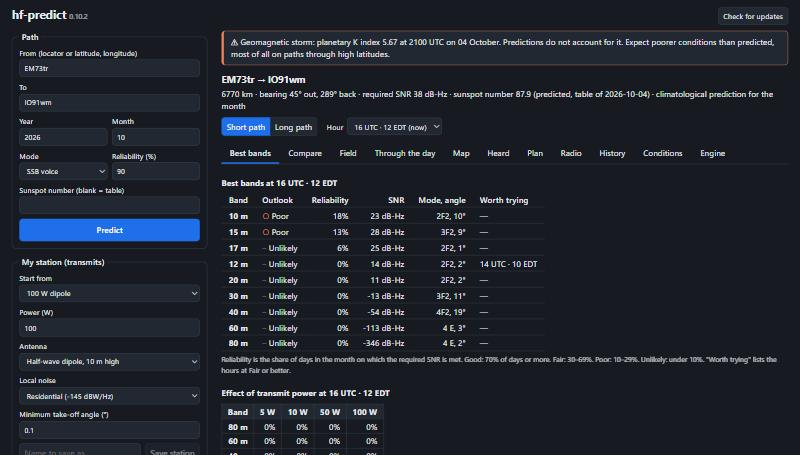
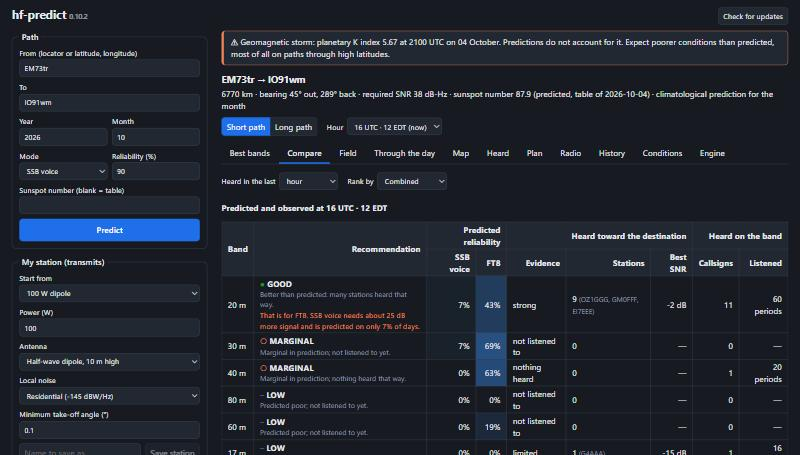
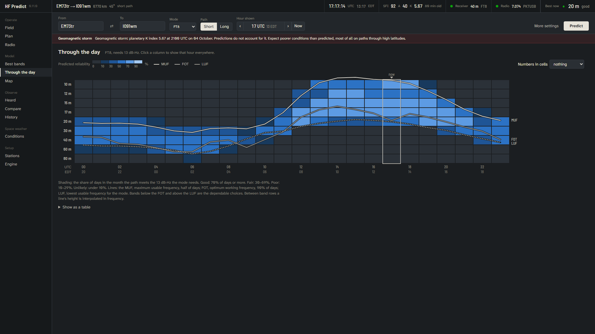

# HF Predict design system

The interface redesign of October 2026 (v0.11.0). It follows the brief to make HF Predict read as a scientific instrument for propagation, not a web dashboard, and was planned and reviewed with Anthropic's `frontend-design` guidance and the `dataviz` method (palette validator, mark specifications).

## Audit of the previous interface

The most important weaknesses, in order:

1. **No answer at a glance.** Nothing on screen said which band to use now. The path, time, solar state and receiver state were spread over a sidebar form, a summary paragraph and individual tabs.
2. **Predicted and measured looked alike.** Model reliability and observed activity were both drawn in the same blue, in tables of similar shape. The Compare tab's central distinction (prediction, evidence, not listened to) was carried by words alone.
3. **The form owned the screen.** A 330 px sidebar of two station editors and saved places was always visible, while the controls used most (From, To, hour, path) were split between it and a row above the tabs.
4. **Eleven flat tabs.** No grouping by purpose; Field duplicated Best bands and Compare; the hour selector and path switch sat outside the views they controlled.
5. **Tables where pictures would do.** Best bands was a table of percentages; Through the day was a line chart and a 24 × 9 number table that said the same thing twice.
6. **Generic chrome.** System font, bright blue buttons, rounded cards, `A · B · C` meta strings everywhere, and colour as the only cue in places (blue shading of counts and Kp).
7. **Weak desktop behaviour.** The page scrolled as a whole, so the context scrolled away; no keyboard shortcuts; the status strip did not exist; at 1024 px the layout stacked.




## Identity

**Subject.** A propagation instrument for operators at home, portable, on Field Day and in emergencies. Its job is to say which band to use, how much to trust the model, and what the receiver actually hears.

**One bold element.** The *band ladder* on Through the day: every band against every hour, shaded by reliability, with the MUF, FOT and LUF lines threaded through the band rows they fall between. Bands are stacked by frequency, so the ladder is also a frequency axis. The same 24-hour strip appears, small, beside every band on Best bands and Field. Everything around it stays quiet.

**Two data hues, one meaning each.**

| Name | Dark | Daylight | Means |
|---|---|---|---|
| Model blue | `#4a8bc8` | `#2f72b8` | What VOACAP predicts |
| Dial amber | `#c48527` | `#b9741a` | What this station's receiver decoded |
| Graphite | `#1b1e21` | `#f1efea` | Background |
| Slate | `#22262a` | `#fbfaf7` | Panels |
| Bone | `#e7e3d9` | `#1c1f22` | Ink, and every interactive selection |

Amber was chosen for measurement because it is the colour of a backlit radio display; blue for the model because it is computed, not heard. The pair passes the dataviz validator against the dark panel (CVD ΔE 22, normal-vision ΔE 25, lightness inside the band, contrast ≥ 3:1) and against the daylight surface. Interaction never uses a data hue: the primary button, focus ring, selected tab and selected hour are all bone, so a selection is never mistaken for a value. Status colours (good `#0ca30c`, caution `#fab219`, serious `#ec835a`, alert `#d03b3b`) always come with a symbol and a word.

**Reliability in six steps**, matching the tiers rather than an arbitrary gradient: under 10, 10–30, 30–50, 50–70, 70–90, 90–100 %. Each step has a fill and a readable ink (`--rel-0`…`--rel-5`, `--rel-ink-0`…`5`), defined for both themes, so every heatmap cell, strip, power table and coverage cell is theme-aware and labels stay legible.

**Type.**

- *Atkinson Hyperlegible Next* for reading. It was designed by the Braille Institute so that easily confused characters stay distinct; callsigns and locators (0/O, 1/I/l, 5/S, 8/B) must not be misread in a hurry.
- *Barlow Semi Condensed* for figures and band names: a condensed grotesque in the manner of front-panel legends, with tabular figures for aligned columns.
- The system monospace only for machine text: decoded FT8 messages and the VOACAP deck.

Both faces are bundled (latin subsets, about 140 kB), so the app looks the same offline. Scale: 11, 12, 13 (base), 14, 16, 18, 22, 34, 40 px.

**Plan reviewed against generic defaults.** The brief fixed a dark charcoal theme, so the review moved the rest away from the common tells: graphite rather than near-black, two semantic hues instead of one acid accent, bone for interaction instead of a blue primary button, sentence-case labels instead of upper-case eyebrows, flat tonal panels with no drop shadows, structure carried by columns and spacing instead of `A · B · C` strings, and monospace kept for real machine text rather than small labels.

## Layout

```
┌ HF Predict │ EM73tr → IO91wm  6770 km 45° │ 17:02:07 UTC 13:02 EDT │ SFI 92 A 40 K 5.67 │ ● Receiver 40 m │ ● Radio 7.074 │ Best now ● 20 m ┐
├─────────────┬─────────────────────────────────────────────────────────────────────────────────────────────┤
│ Operate     │ From [EM73tr] ⇄ To [IO91wm]  Mode [SSB]  Path [Short|Long]  Hour ‹ 17 UTC 13 EDT › Now   Predict │
│  Field      ├─────────────────────────────────────────────────────────────────────────────────────────────┤
│  Plan       │ Geomagnetic storm  …                                         (only when there is one)        │
│  Radio      ├─────────────────────────────────────────────────────────────────────────────────────────────┤
│ Model       │                                                                                             │
│  Best bands │   the view, scrolling on its own                                                            │
│  Through…   │                                                                                             │
│  Map        │                                                                                             │
│ Observe     │                                                                                             │
│  Heard      │                                                                                             │
│  Compare    │                                                                                             │
│  History    │                                                                                             │
│ Space wx    │                                                                                             │
│ Setup       │                                                                                             │
└─────────────┴─────────────────────────────────────────────────────────────────────────────────────────────┘
```

- **Status strip**, always visible: the path, the live clock in UTC and local time, solar flux, A and K with their age, the receiver and the radio as a dot and a word, a clock warning when it applies, and the best band now (the combined recommendation at the current hour). Each readout opens the view behind it. At narrow widths it wraps rather than overlapping.
- **Alert lines** under the path bar, full width, label at the left and any actions at the right edge: geomagnetic storm (alert red), clock (caution amber), and a pending update (neutral panel, bone *Install and restart* and a quiet *Later*). An update is not data, so it never wears model blue; its status-strip cell is tinted with bone too (v0.11.6).
- **Navigation** grouped by purpose: Operate (Field, Plan, Radio), Model (Best bands, Through the day, Map), Observe (Heard, Compare, History), Space weather, Setup (Stations, Engine). Views that need a predicted path say so.
- **Path bar**, always visible: From and To with a swap button, mode, short or long path, an hour stepper showing UTC and local time with Now, and Predict. Year, month, required reliability, sunspot number and the two station presets fold away under *More settings*. A note appears when the settings have changed since the last prediction.
- The app reopens with the last path, mode, path direction and view, and predicts it straight away.
- Content is left aligned; only the view scrolls.

### Window sizes

Checked at 1024 × 700, 1280 × 720, 1366 × 768, 1600 × 900 and 1920 × 1080 (v0.11.2):

- The status strip is always one row. As the window narrows it drops detail in a fixed order: the distance, bearing and data-age notes first (below 1540 px), then the version and path kind (below 1300 px), then local time (below 1100 px). The path itself truncates last.
- The path bar is one row from about 1240 px; below that it breaks deliberately, places on the first line and the hour stepper with the actions on the second. A prediction made with older settings shows Update with a caution dot instead of a sentence.
- Every text field, menu and button is 30 px high, so mixed rows line up.
- Views stop at 1280 px wide (the band ladder and map at 1560 px), and panels and large tables span that width, so right edges agree.
- Table cells never wrap mid-value: SNR and its margin are two deliberate lines, and the propagation-mode column steps aside below 1300 px. On Compare the first line of each heard cell stays on one line and the *On the whole band* column steps aside below 1100 px (v0.12.0).
- Settings are grouped forms with labels above aligned fields (Radio, Heard), not wrapping rows of inline labels.

## Views

- **Field** — the three bands to try at the hour shown, in large figures, each with the recommendation, the model for the operator's mode and for FT8, how much was heard that way, a 24-hour strip and the good hours in UTC and local time; beside them the map and a list of data ages. Two columns down to 980 px.
- **Best bands** — one sentence answering which band to try; then every band ranked, with a reliability bar marked at 30 % and 70 %, SNR with how much it is short of or above what the mode needs, a 24-hour strip, the hours worth trying and the propagation mode. The power table follows.
- **Through the day** — the band ladder. Hover a cell for reliability, SNR, days open, mode and angle; click a column to show that hour everywhere; optionally print a value in each cell. It is drawn at the width of its container, so text stays the same size on any screen. The full table is one click away.
- **Compare** — the defining view. Each band has a model column (two blue bars, FT8 and the operator's mode) and a heard column (three amber steps, or a hatched outline when the band was not listened to long enough). *Nothing heard that way* and *not listened to* never look alike. The recommendation carries its symbol, its reason, and a caution when an FT8-based label sits beside a poor prediction for the operator's own mode. A *Hears your area* column (v0.12.0) shows the other direction, marked with an amber ring: stations that way heard reporting this station or one near it.
- **Map** — graticule on Maidenhead fields, land in a single tone, night as a translucent shade, the path in bone with a halo, coverage in the reliability steps with coastlines drawn over it, heard stations as amber dots ringed in the sea colour, stations heard reporting this area as amber rings with a sea halo (a dot inside a ring was heard both ways), and a key below. Filled amber is "heard here"; an amber outline is "hears here".
- **Heard** — a status pill and the listener settings in one panel; activity by band with a small north-up rose for stations by direction (area proportional to count); *Who hears your area*, a table of distant stations heard reporting this station or its neighbours, with whom they reported; latest decodes with band filter, search, sortable time, SNR and distance, and whether each came live or from a log.
- **Plan** — the manual plan on the left (bands to tick in WSJT-X, the schedule, why this order) and the automatic, receive-only scan on the right with its own status pill, readiness checklist, confirmation, Start and a red STOP SCAN.
- **Radio** — a status pill, a large frequency readout with band, mode and Receiving or Transmitting, then the connection and start-for-me settings.
- **History** — columns of how often places were heard against what the model predicted, each with a 95 % Wilson interval and the number of listening hours under it; columns on fewer than 20 hours are faint. The explanation says to read the shape, not the height.
- **Conditions** — readings for solar flux, A, K, daily sunspot number and X-ray background, each with what the value means, its source and age, and a different look when old or missing; the three-day Kp forecast as columns coloured only when active or stormy; then what the model itself uses and each product in full.
- **Stations** — both station editors, saved places, Dark or Daylight, keyboard shortcuts, updates, and the third-party licences.
- **Engine** — what was run, with the input deck and output behind disclosures and copy buttons.

Screenshots at 1366 × 768 with a real FT8 prediction from the engine (EM73tr to IO91wm, October) and recorded decodes:




## Visualisation conventions

- Axis titles name the quantity and unit; ticks are clean numbers; gridlines are hairlines in a step off the surface, never dashed.
- Time axes always show UTC with local time underneath; the "now" hour has a notch, the hour shown has a bone outline.
- Lines are 2 px with a surface-coloured halo where they cross shaded cells; the LUF is dotted so it reads apart from the FOT; columns are at most 24 px wide with a rounded data end; dots are ringed in the surface colour.
- Text never wears a data colour; identity comes from a key beside plain ink.
- Missing values break lines rather than drawing zero; an absent LUF is stated in the key.
- Sparse data is shown as sparse: faint columns under 20 hours, hatched outlines for bands not listened to, "old" and "no data" on readings.
- Every chart has a table view or a tooltip with exact values.

## Interaction

- Ctrl+Enter predicts; Alt+1 … Alt+0 switch views in the order of the navigation; `[` and `]` step the hour, `n` returns to now.
- Visible bone focus ring on every control; disabled controls fade; buttons say what they do.
- Live data refreshes without reflowing: rows keep stable keys, readings update in place.
- Reduced motion is respected; there is no decorative animation. The one animation is functional: the dot of a pending update pulses in the status strip until the operator answers the notice, and it does not run with reduced motion.
- Daylight theme for outdoor use, chosen under Stations and remembered.

## What did not change

No calculation, threshold, recommendation rule or back-end command changed. The scan safeguards are untouched and were exercised in the preview: the readiness checklist blocks Start until every rule holds and the operator confirms the antenna system; Start and STOP SCAN call the same commands with the same arguments; the radio is still put back on the saved frequency. The updater, WSJT-X listener, log reading, rigctld handling and offline operation are as before.

## Known limits

- Checked in the browser preview and in headless Edge with recorded data at 1024 × 700, 1366 × 768 and 1920 × 1080, in both themes; not yet looked at inside the installed app on Linux or macOS, or at Windows display scaling above 100 %.
- `color-mix()` is used for a few washes (alert line, row hover); on an older Linux WebKitGTK they fall back to no tint.
- The band ladder interpolates line height between band rows in frequency; above 28 MHz or below 3.6 MHz the line runs along the edge, and the exact values are in the tooltip and table.
- Below 860 px the navigation becomes a scrolling row; the app is meant for laptop screens and larger.
